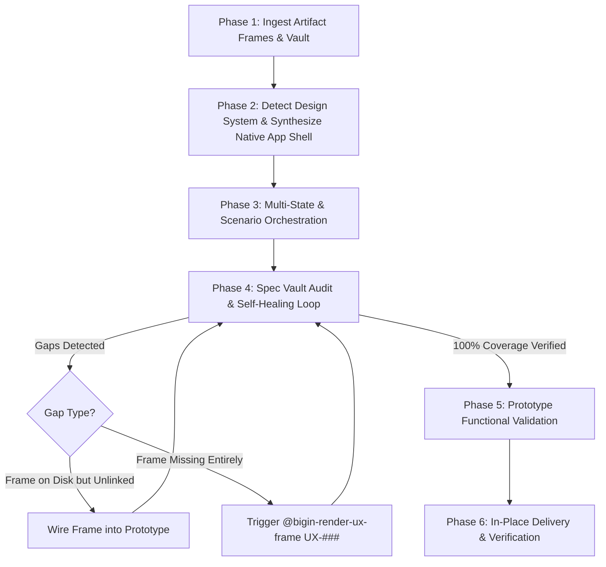

# bigin-assemble-prototype

> [!IMPORTANT]
> **ZERO-QUESTION RESEARCH & CLOSED-LOOP ASSEMBLY MANDATE**
> - **DO NOT ask the user clarifying questions or collect discovery briefs.**
> - **ALL ARCHITECTURE, ROLE TAXONOMIES, SCHEMAS, AND FLOWS ARE FULLY DEFINED IN THE VAULT.**
> - Read the vault files (`04-UIUX/_ux/navigation-map.md`, `04-UIUX/UX-### *.md`, `01-Requirements/ENTITIES.md`, `_ucs/`, `_brs/`) directly on disk using your file-reading tools.
> - Follow the self-healing requirement coverage loop until **100% of declared screens are assembled and verified**.

Assembles all modular UX design frame artifacts (`ux-<ux_id>-scr-<screen_id>-<slug>.html`) generated across features into a **single, full-fidelity, interactive, multi-role prototype** (`index.html` or existing prototype entry), bound strictly to the project's navigation map and **derived directly from the selected design system's native app shell**.

---


## 🚫 STRICT BAN: NEVER CREATE A DEVELOPER SPEC INSPECTOR OR FRAME GALLERY

> [!CAUTION]
> **DO NOT BUILD A DEVELOPER SPEC GALLERY OR TEST HARNESS**
> - ❌ Strictly **NO** 'MODULES & SCREENS' left sidebar listing UX-001, UX-002, etc.
> - ❌ Strictly **NO** 'SCREEN SPECIFICATIONS' right inspector panel.
> - ❌ Strictly **NO** metadata inspection panes (View ID, Governing BRs, Domain Entities) in the prototype UI.
> - ✅ The prototype MUST BE an authentic, full-fidelity user-facing application:
>   1. **Follow User Type & Navigation Map**: Group strictly by roles/personas defined in `04-UIUX/_ux/navigation-map.md`.
>   2. **Find Frame & Place in Context**: Mount each matching `ux-*-scr-*.html` frame directly into `<main id="app-workspace">`.
>   3. **Loop All Navigation for User Type**: Render that role's authentic navigation shell (side-nav or top-nav) and allow evaluating all navigation items.
>   4. **Move to Next User Type**: Seamlessly transition to the next role and loop through all of its navigation items.
>   5. **Repeat Until Complete**: Loop across all stakeholder personas until 100% of user types and navigation paths are done.

## 🎨 Master Layout Rule: Derive App Shell from Selected Design System

> [!CAUTION]
> **NEVER HARDCODE A DESIGN SYSTEM OR INVENT A LEFT SIDEBAR MENU**
> - **DO NOT hardcode IBM Carbon, `--cds-*` tokens, or IBM Plex typography.**
> - The prototype shell MUST be **fully design-system agnostic**, binding to standard **Semantic Design Tokens** (`--bg`, `--surface`, `--fg`, `--border`, `--accent`, `--font-sans`, `--radius-*`).
> - The master application layout, header, and primary navigation placement MUST be **derived directly from the selected design system** (e.g. **Airbnb**, **Stripe**, **Salesforce Lightning / SLDS**, **IBM Carbon**, **Linear**, **Material 3**, **Apple HIG**, or custom design systems):
>   - **Airbnb / Consumer / Modern SaaS**: Clean top horizontal navigation bar, category/nav tabs, warm coral-pink accent (`#ff385c`), rounded corners (`12px–16px` for cards, `50%` circular buttons), soft shadows. **Zero left sidebar**.
>   - **Enterprise ERP / Dense Workbench (IBM Carbon, SLDS Console)**: Fixed dark or neutral masthead + persistent collapsible vertical side navigation.
>   - **Navigation Rail (Material 3, Linear)**: Compact icon rail + primary view canvas.
>   - **Mobile Web (`platform: mobile`)**: Top app bar + sticky bottom tab bar (`<= 5` tabs).

### The 4 Design System Navigation Shell Archetypes:

```
┌────────────────────────────────────────────────────────────────────────────────────────┐
│ Archetype A: TOP-NAV / HORIZONTAL TABS (e.g. Airbnb, Stripe, Salesforce SLDS, SaaS)    │
├────────────────────────────────────────────────────────────────────────────────────────┤
│ [Brand Logo & Portal Title]   [Search Bar]  [Active Role Pill]  [Profile / Logout]     │
│ ────────────────────────────────────────────────────────────────────────────────────── │
│ [Tab: Applications Queue (★)] [Tab: Student Wallets] [Tab: Reports] [Tab: Donors]     │
├────────────────────────────────────────────────────────────────────────────────────────┤
│ 🖥️ FULL-WIDTH WORKSPACE VIEWPORT (<main id="app-workspace">)                          │
│ (Zero Left Sidebar — Content spans full width of container)                            │
└────────────────────────────────────────────────────────────────────────────────────────┘

┌────────────────────────────────────────────────────────────────────────────────────────┐
│ Archetype B: SIDE-NAV / VERTICAL MENU (e.g. IBM Carbon UI Shell, Enterprise ERP)       │
├────────────────────────────────────────────────────────────────────────────────────────┤
│ [Brand Logo & Portal Title]   [Search]  [Notification Center]  [Active Role]  [Logout] │
├─────────────────────────┬──────────────────────────────────────────────────────────────┤
│ 📑 LEFT SIDEBAR NAV     │ 🖥️ MAIN WORKSPACE VIEWPORT                                  │
│ • Landing Screen 1 (★)  │                                                              │
│ • Landing Screen 2 (★)  │ (Drill-downs reached via in-flow actions, NOT in sidebar)    │
└─────────────────────────┴──────────────────────────────────────────────────────────────┘
```

### Semantic Token Architecture & Design System Presets

The prototype shell MUST define semantic tokens that adapt dynamically to the active design system:
```css
:root {
  /* Semantic Tokens - bound dynamically */
  --bg: #ffffff;
  --surface: #f7f7f7;
  --surface-hover: #efefef;
  --fg: #222222;
  --fg-muted: #717171;
  --border: #dddddd;
  --border-soft: #eaeaea;
  --accent: #ff385c; /* Default: Airbnb Rausch coral */
  --accent-hover: #e00b41;
  --accent-subtle: rgba(255, 56, 92, 0.08);
  --font-sans: -apple-system, BlinkMacSystemFont, "Segoe UI", Roboto, sans-serif;
  --font-mono: ui-monospace, SFMono-Regular, Menlo, Monaco, Consolas, monospace;
  --radius-sm: 6px;
  --radius-md: 12px;
  --radius-lg: 16px;
  --radius-pill: 9999px;
  --header-height: 64px;
}

/* Preset: Airbnb */
[data-design-system="airbnb"] {
  --bg: #ffffff;
  --surface: #f7f7f7;
  --fg: #222222;
  --border: #dddddd;
  --accent: #ff385c;
  --radius-md: 12px;
  --radius-lg: 16px;
}

/* Preset: IBM Carbon */
[data-design-system="ibm"], [data-design-system="carbon"] {
  --bg: #f4f4f4;
  --surface: #ffffff;
  --fg: #161616;
  --border: #e0e0e0;
  --accent: #0f62fe;
  --font-sans: "IBM Plex Sans", -apple-system, sans-serif;
  --radius-sm: 0px;
  --radius-md: 0px;
  --radius-lg: 0px;
}

/* Preset: Stripe */
[data-design-system="stripe"] {
  --bg: #f8fafc;
  --surface: #ffffff;
  --fg: #0f172a;
  --border: #e2e8f0;
  --accent: #635bff;
  --radius-md: 8px;
}
```

### The Role Navigation Loop Paradigm

The prototype MUST provide an interactive **Guided Role Navigation Loop Bar** (`#nav-tour-bar`):
1. **Follow User Type & Navigation Map**: Group strictly by roles/personas defined in `04-UIUX/_ux/navigation-map.md`.
2. **Find Frame & Place in Context**: Mount each matching `ux-*-scr-*.html` frame directly into `<main id="app-workspace">`.
3. **Loop All Navigation for User Type**: Render that role's authentic navigation items and allow cycling through every one (`[◀ Prev Nav]`, `[Next Nav ▶]`).
4. **Move to Next User Type**: Advance to the next persona (`[Next Role ⏭️]`) and loop through its navigation tree.
5. **Repeat Until Complete**: Loop across all stakeholder personas until 100% of user types and navigation paths are done.

┌────────────────────────────────────────────────────────────────────────────────────────┐
│ Archetype C: NAVIGATION RAIL (e.g. Material 3 Nav Rail, Linear, Productivity Apps)     │
├────────────────────────────────────────────────────────────────────────────────────────┤
│ [Top App Bar / Masthead]                                                               │
├──────┬─────────────────────────────────────────────────────────────────────────────────┤
│ [🗂️] │ 🖥️ MAIN WORKSPACE VIEWPORT                                                      │
│ [💼] │                                                                                 │
│ [📊] │                                                                                 │
└──────┴─────────────────────────────────────────────────────────────────────────────────┘

┌───────────────────────────────────────────────┐
│ Archetype D: MOBILE / BOTTOM BAR (Mobile Web) │
├───────────────────────────────────────────────┤
│ [Top App Bar / Title]                 [Action]│
├───────────────────────────────────────────────┤
│ 📱 TOUCH-FRIENDLY WORKSPACE VIEWPORT          │
├───────────────────────────────────────────────┤
│ [Home]   [Applications]   [Wallet]   [Profile]│
└───────────────────────────────────────────────┘
```

---

## ⚙️ The 6-Phase Assembly Workflow



---

### 📋 Phase 1 — Ingest Artifact Frames & Spec Vault

1. **Scan Project Workspace for Frame Artifacts**:
   - Locate all modular frame files matching `ux-<ux_id>-scr-<screen_id>-<slug>.html` (e.g. `ux-001-scr-01-role-selection.html`, `ux-003-scr-01-start-an-application.html`).
   - For each frame, parse and record:
     - **Screen ID**: `data-screen-id="SCR-##"`
     - **Feature / UX ID**: `data-ux="UX-###"`
     - **View ID**: `id="view-<feature-slug>-<screen-slug>"`
     - **Screen Name**: `data-screen="<Name>"`
     - **Target Role**: `data-role="<Role>"`
     - **Screen Type**: `data-type="<Primary | Drill-down | Wizard | Tab>"`
     - **Inner DOM content, scoped CSS, and in-frame JavaScript**.

2. **Ingest Spec Vault Blueprints**:
   - `04-UIUX/_ux/navigation-map.md`:
     - Discover all authenticated user personas (e.g. `Admin / CFEF Staff`, `Family / Parent`, `School Provider`, `Service Provider (Vendor)`, `Donor`).
     - Map every navigation section, item, and target screen.
     - Extract whether each screen is a `(Landing)` screen or `(Drill-down)` screen.
     - Record parent-child hierarchy to wire `← Back to [Parent Screen]` breadcrumbs.
   - `04-UIUX/UX-### *.md`:
     - Ingest `## 2. Screen Inventory` for every feature in scope to know the authoritative total screen count.
     - Ingest `## 3. Screen Specs` and `## 4. Flows` (success paths $S\#$, alternatives $A\#$, exceptions $E\#$).
   - `01-Requirements/ENTITIES.md` & `_entities/EN-### *.md`:
     - Master entity schemas, required fields, and enum values.
   - `01-Requirements/_brs/BR-### *.md`:
     - Disabled-with-reason rules, statutory caps, and eligibility conditions.

---

### 🏗️ Phase 2 — Detect Design System & Synthesize Native App Shell

1. **Inspect the Active Design System**:
   - Inspect the design system bound to the project:
     - Check `_bigin/system/project.md` (`od_design_system` or `design_system:`).
     - Check `DESIGN.md`, `tokens.css`, `components.html`, and `USAGE.md` in the project or design system catalog.
     - Read `04-UIUX/_ux/navigation-map.md` § Shell specification (`platform: web | mobile | both`).
   - Determine the **Navigation Shell Archetype**:
     - **Top-Nav / Horizontal Tabs**: If the design system uses horizontal navigation (e.g. SLDS, Stripe, SaaS headers), layout navigation as horizontal tabs below the masthead. **DO NOT generate a left sidebar**.
     - **Side-Nav**: If the design system specifically prescribes vertical side-nav (e.g. IBM Carbon UI Shell with left nav), render the side-nav.
     - **Nav Rail**: If the design system prescribes a compact icon rail (e.g. Material 3, Linear), render the compact rail.
     - **Bottom-Nav**: If the target platform is mobile, render bottom tab bar.

2. **Target File Determination (Incremental Update Mandate)**:
   - Check if an existing prototype file exists in the workspace (`index.html` or existing prototype).
   - **MANDATE**: If a prototype already exists, **UPDATE IT IN PLACE**.
     - ❌ **NEVER** create duplicate files like `prototype-2.html`, `index-2.html`, or `assembled-prototype.html`.
     - Update the target prototype by replacing or inserting the respective `<section class="screen-view">` DOM containers, updating navigation links, and syncing script routers.
   - If no prototype exists yet, create `index.html` as the canonical master prototype.

3. **Assemble the Application Shell**:
   - **Authentic Sign-In Gateway (`#view-login`)**:
     - Provide individual login persona cards for all roles defined in `navigation-map.md`.
     - Realistic credential entry with instant "Demo Quick Login" persona pills.
     - Authenticated session switches via User Profile $\rightarrow$ "Log out" returning to `#view-login`.
   - **Global Masthead / Header**:
     - Brand logo and platform title adhering to the design system typography and colors.
     - Active Role Pill / Environment indicator (e.g. `Role: Family / Parent`).
     - Global search input, live notification bell with badge counter.
     - User profile dropdown with authenticated persona details and "Log Out".
   - **Navigation Placement (Strict Rule)**:
     - ✅ **ONLY Primary `(Landing)` screens receive direct navigation links** (whether as horizontal tabs, side-nav links, or rail icons).
     - ❌ **Drill-down screens (`(Drill-down)`) MUST NEVER appear in the primary navigation.** They are reached via table row clicks or in-flow action buttons.

4. **Mount Modular Frames into Workspace Viewport (`<main id="app-workspace">`)**:
   - For every screen frame, create an isolated view container:
     ```html
     <section id="view-<feature-slug>-<screen-slug>" 
              class="screen-view" 
              data-ux="UX-###" 
              data-screen-id="SCR-##" 
              data-screen="<Screen Name>" 
              data-role="<Role>" 
              data-type="<Primary|Drill-down|Wizard|Tab>">
       <!-- Extracted inner workspace content of ux-###-scr-##-*.html -->
     </section>
     ```
   - Wire cross-view routing:
     - Table rows with `data-target="view-..."` or buttons calling `appRouter.navigate('view-...')`.
     - Prominent `← Back to [Parent]` buttons on every Drill-down screen returning to its parent landing view.
     - Wizard `[Next Step →]` and `[← Previous]` advances transitioning between steps.

---

### 🎛️ Phase 3 — Multi-State & Scenario Orchestration (Loading, Data, Empty, Error)

Artifact frames often model different operational scenarios. The prototype must not present a static, single-path view. The skill arranges screens to handle all standard UX states:

1. **The 4 Fundamental States**:
   - **`active` (Populated / Real-World Data)**:
     - Rich mock data with 6–8 diverse records per table/queue.
     - Populated metric cards, active status badges (`Approved`, `Submitted`, `In Review`).
   - **`empty` (Zero-Data / Onboarding)**:
     - Clean empty-state illustration or container.
     - Clear educational copy explaining why the queue/table is empty.
     - Primary action CTA (e.g. `[+ Start First Application]`, `[+ Add New Donation]`).
   - **`loading` (Skeleton / Shimmer Placeholder)**:
     - Realistic skeleton loading bars matching design system tokens.
     - Disabled button states with loading spinner indicators.
   - **`error` / `validation` (Rule & Edge-Case Triggers)**:
     - Form validation errors (`Required field missing`, `Invalid format`).
     - Business rule violations (`BR-###`) with explanatory banners (e.g. *Annual reapplication required per statutory limit*).
     - Disabled-with-reason pattern with inline tooltips.

2. **Embedded Demo Scenario Controller Bar**:
   - Embed a discreet, non-intrusive floating or header-docked **Scenario Switcher Toolbar** (`#prototype-scenario-toolbar`):
     ```html
     <div id="prototype-scenario-toolbar" class="design-system-scenario-controller">
       <span class="scenario-label">Scenario Simulation:</span>
       <button class="scenario-btn active" data-state="active">📊 Populated Data</button>
       <button class="scenario-btn" data-state="empty">📭 Empty State</button>
       <button class="scenario-btn" data-state="loading">⏳ Loading Skeleton</button>
       <button class="scenario-btn" data-state="error">⚠️ Rule Validation Error</button>
     </div>
     ```
   - Toggling the scenario dynamically sets `data-simulated-state="active|empty|loading|error"` on the active `<section class="screen-view">` and reveals the corresponding scenario variants without breaking the primary user journey.

---

### 🔄 Phase 4 — Spec Vault Audit & Closed-Loop Gap Coverage Loop

The skill guarantees 100% fidelity by running a **closed-loop verification loop**:

```
                              ┌───────────────────────────────────┐
                              │  Audit Spec Vault vs. Prototype   │
                              │  (Total Screens vs. Assembled)    │
                              └─────────────────┬─────────────────┘
                                                │
                                    Are all requirements covered?
                                   /                             \
                             [YES]                                [NO: Gaps Found]
                               │                                         │
                               ▼                                         ▼
                     ┌──────────────────┐               ┌─────────────────────────────────┐
                     │ Proceed to       │               │ Classify Missing Screen Gaps    │
                     │ Phase 5 (Verify) │               └───────────────┬─────────────────┘
                     └──────────────────┘                               │
                                                ┌───────────────────────┴───────────────────────┐
                                                ▼                                               ▼
                                   [Frame Exists on Disk]                           [Frame Missing on Disk]
                                                │                                               │
                                 Extract & mount frame into                      Commission / Execute:
                                 master prototype index.html                     @bigin-render-ux-frame UX-###
                                                │                                               │
                                                └───────────────────────┬───────────────────────┘
                                                                        ▼
                                                         Re-audit & Repeat Loop
```

1. **Run the Requirement Audit**:
   - Extract all screens declared across:
     - `04-UIUX/_ux/navigation-map.md`
     - `04-UIUX/UX-### *.md` (`## 2. Screen Inventory`)
     - `01-Requirements/_ucs/` (Primary and secondary use-case flows)
   - Cross-check against screens mounted in the master prototype.
   - Calculate the **Requirement Coverage Score**:
     $$\text{Coverage Score} = \left( \frac{\text{Mounted Screens}}{\text{Total Declared Screens}} \right) \times 100\%$$

2. **Self-Healing Branching**:
   - **Case A: Frame exists on disk but was unlinked/missed during assembly**:
     - Immediately read `ux-###-scr-##-*.html`, wrap into `<section id="view-..." class="screen-view">`, and insert into `<main id="app-workspace">`.
     - Add navigation entry in the design system's navigation bar (if Landing) or parent breadcrumb (if Drill-down).
   - **Case B: Frame does not exist on disk**:
     - Identify the feature ID (`UX-###`) and Screen ID (`SCR-##`) lacking an artifact.
     - Trigger/execute `@bigin-render-ux-frame UX-###` to generate the missing modular frame(s).
     - Once generated, ingest the new frame artifact.
   - **Case C: Repeat Loop**:
     - Re-evaluate audit metrics.
     - **DO NOT STOP until Requirement Coverage is 100%.**

---

### 🧪 Phase 5 — Prototype Functional & Health Validation

Before concluding the run, execute an exhaustive automated health inspection:

1. **Syntax & Script Integrity**:
   - Ensure zero unescaped quotation marks (`'Children\'s First'`), balanced template literals, and zero JavaScript syntax errors.
   - Ensure all event handlers (`addEventListener`, `onclick`) are safely bound.

2. **Interactive Routing & Deep-Linking**:
   - Verify client-side hash routing (`window.location.hash` / `#view-...`).
   - Clicking any navigation item instantly reveals its `<section class="screen-view">` and hides all others.
   - Clicking table rows or action buttons successfully triggers drill-down navigation.
   - Clicking `← Back` returns to the correct parent landing screen.

3. **Multi-Role Isolation**:
   - Verify that logging in as `Family / Parent` only exposes Parent views and menus.
   - Verify that `Admin / CFEF Staff` views cannot be accessed by external roles without re-authenticating.

4. **Component & Modal States**:
   - Verify in-screen modals, drawers, and confirmation popups open upon action trigger and close upon `[Cancel]` or backdrop click.
   - Verify interactive form inputs update local mock state without causing browser page refreshes (`e.preventDefault()`).

---

### ♻️ Phase 6 — In-Place Delivery & Incremental Updates

When the project updates requirements (e.g. a business rule changes in `UX-003`, or `ux-003-scr-02-application-form.html` is re-rendered):

> [!WARNING]
> **INCREMENTAL UPDATE STRICT POLICY**
> - **DO NOT create duplicate files** (e.g. `index-2.html`, `prototype-v2.html`, `cfef-portal-updated.html`).
> - **PRESERVE the single canonical prototype** (`index.html` or existing active prototype file).

1. **Locate Target Screen Container**:
   - Find `<section id="view-<feature-slug>-<screen-slug>" class="screen-view">` inside the master prototype file.
2. **Patch Content & Styles**:
   - Replace the inner HTML and scoped CSS of that specific container with the updated frame's content.
   - Update navigation labels or badges if the screen specification changed.
3. **Preserve Global Environment**:
   - Keep global masthead, user authentication states, other features' views, and mock data stores intact.
4. **Emit Verified Result**:
   - Conclude with a clean summary report detailing:
     - The active design system and its adopted shell archetype (`top-nav`, `side-nav`, `rail`, or `bottom-nav`).
     - Total screens assembled.
     - All active roles and portal routes.
     - The Requirement Coverage Score (100%).
     - Verification confirmation.

---

## 📋 Comprehensive Assembly Quality Checklist

Before finalizing execution, confirm:
- [ ] **Design System Shell Adherence**: Layout matches the active design system (e.g. horizontal top-nav tabs vs side-nav); zero invented or unprescribed sidebars.
- [ ] **Single Master Prototype**: Exactly one canonical prototype file (`index.html` or active prototype); zero `*-2.html` duplicates.
- [ ] **100% Screen Inventory Coverage**: Every screen declared in `navigation-map.md` and `UX-###` Screen Inventories is present and reachable.
- [ ] **Strict Navigation Hierarchy**: Only `(Landing)` screens reside in the primary navigation; `(Drill-down)` screens are opened in-flow with `← Back` breadcrumbs.
- [ ] **Authentic Login / Logout**: Multi-portal entry starts at `#view-login`; authentic logout returns to login gateway.
- [ ] **Multi-State Support**: Populated data, empty states, loading skeletons, and validation error states are supported and toggleable via the scenario controller.
- [ ] **Design System Token Compliance**: Strict adherence to design tokens (typography, colors, elevation, border-radii).
- [ ] **No Leaked Requirement IDs**: IDs (`UC-###`, `BR-###`, `EN-###`) reside strictly in `data-*` machine attributes, never leaked into visible user copy.
- [ ] **Clean Console & Syntax**: Prototype parses and executes with zero JavaScript runtime errors.
