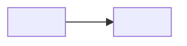

# `EP-<NNN> <Outcome, as a short active phrase>`
<!-- guide: _bigin/templates/epic.guide.md -->

## 1. Goal & Outcome

* **For:** `<the actor(s) who get the value — roles, never named people>`
* **Outcome:** `<what is different for them once every story here is done, in the client's words>`
* **Why now:** `<the pain point or business need it resolves — PP-### / UC § 1 Business Need>`
* **Success looks like:** `<a stated measure, or "not stated — decision needed">`

## 2. Scope

**In scope**

* `<one line per use case or slice this epic delivers>`

**Out of scope**

* `<what a reader might expect here but is deliberately not — and where it lives instead>`

## 3. Story Map

| Priority | `<UC step group 1>` | `<UC step group 2>` | `<UC step group 3>` |
| :--- | :--- | :--- | :--- |
| **P1** | `US-<NNN>` | `US-<NNN>` | `US-<NNN>` |
| **P2** | | `US-<NNN>` | |
| **P3** | | | `US-<NNN>` |

## 4. Screen Flow

| Screen | Purpose | Stories | Snapshot |
| :--- | :--- | :--- | :--- |
| `<Screen>` | `<one line>` | `US-<NNN>` | `` |

## 5. Lifecycle

### `<Entity>`

## 6. Business Rules

| Rule | Statement (short) | Stories |
| :--- | :--- | :--- |
| `BR-<NNN>` | | `US-<NNN>` |

## 7. Coverage Matrix

| UC step | Story |
| :--- | :--- |
| `UC-<NNN> S1` | `US-<NNN>` |

## 8. Done When

- [ ] `<a business check a product owner can confirm by using the product>`

## 9. Open Questions, Decisions & Assumptions

**Still open**

**Decisions**

**Assumptions**

## Changelog

| Version | Date | Change | By |
| :--- | :--- | :--- | :--- |
