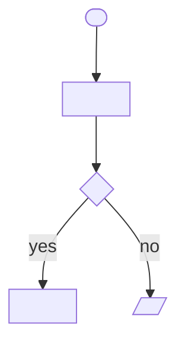

# `US-<NNN> <What the user gets, as a short active phrase>`
<!-- guide: _bigin/templates/user-story.guide.md -->

## 1. Story

**As a** `<role>`, **I want** `<capability>`, **so that** `<business value>`.

* **Why this priority:** `<one line — why P1/P2/P3, from the UC and the story map>`
* **Independent test:** `<how a reviewer can confirm this story alone delivers value: "Can be tested by … and delivers …">`
* **Slice of:** `<UC-<NNN> S1–S6 · the main success path>` — `<one line on what this slice leaves to later stories>`

## 2. Flow

| Step | The user | The system |
| :--- | :--- | :--- |
| **S1** | | |

## 3. Flowchart



## 4. State Changes


## 5. Screens

### `<Screen name>`


* **Purpose:** `<one line>`
* **Reached from:** `<screen / action / link>` · **Leads to:** `<screen(s)>`

**Fields**

| Field | Kind | Required | Default | Rule | Message when wrong | Information |
| :--- | :--- | :--- | :--- | :--- | :--- | :--- |
| `<label as shown>` | `<text / number / date / choice / yes-no / file>` | `<yes / no / when …>` | | `<BR-### or stated rule>` | `<the copy the user reads>` | `<EN-###.field>` |

**Actions**

| Action | Available when | What happens | Goes to |
| :--- | :--- | :--- | :--- |
| `<button / link as labelled>` | | | |

**States**

| State | When | What the user sees |
| :--- | :--- | :--- |
| `<empty / error / read-only / success>` | | |

## 6. Acceptance Criteria

```gherkin
Scenario: AC1 — <name> [S1] [BR-<NNN>]
  Given <a business situation>
  When <the user does something>
  Then <an outcome the user or the business can see>
```

## 7. Boundaries

* `<what this story must not change — an existing behaviour, another role's view, a rule owned elsewhere>`

## 8. Notes

**Still open**

**Decisions**

**Assumptions**

## 9. Definition of Ready

- [ ] Every acceptance criterion traces to a UC step, flow, or BR
- [ ] Every screen above has a snapshot image (or the snapshot gap is a § 8 question)
- [ ] No § 8 question still open
- [ ] Independent, valuable on its own, small enough to estimate, testable (INVEST)
- [ ] Business language only — a product owner can confirm or deny every line

## Changelog

| Version | Date | Change | By |
| :--- | :--- | :--- | :--- |
